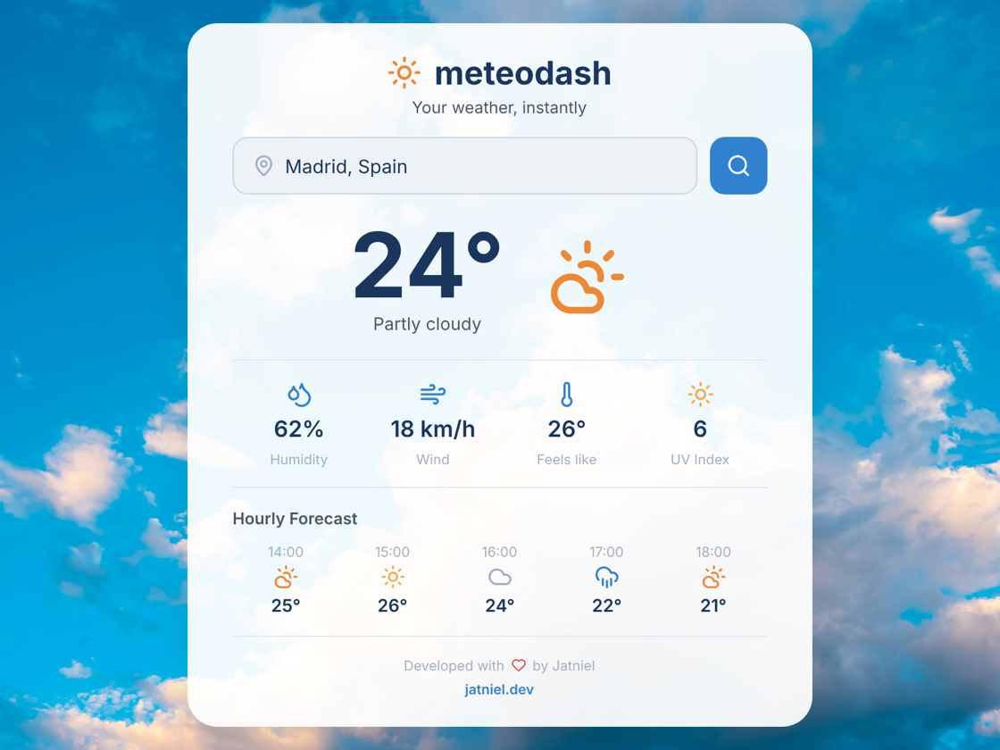

# MeteoDash


A simple weather dashboard built with **Symfony 8** and the **OpenWeatherMap API**.

Created by **Jatniel Guzmán** - [jatniel.dev](https://jatniel.dev)

Built for the [DevChallenges - Week 15](https://devchallenges.yoandev.co/challenge/2026-week-15/) organized by **[YoanDev](https://github.com/yoanbernabeu)**.

<p align="center">
  
</p>

---

## Features

- Search weather by city name
- Current temperature, description and weather icon
- Detail cards: humidity, wind speed, feels like, pressure
- 3-hour forecast (next 5 slots)
- Fully responsive: mobile, tablet, Full HD, 2K, 4K, 5K, 6K
- No external JS dependencies - vanilla JavaScript

---

## How it works

The user types a city name. The frontend sends an AJAX request to the Symfony backend, which calls the OpenWeatherMap API and returns weather data as JSON.

```
Browser (weather.js)
  → GET /api/weather/{city}
    → WeatherController::apiWeather()
      → WeatherService::getWeather()    → OpenWeatherMap /data/2.5/weather
      → WeatherService::getForecast()   → OpenWeatherMap /data/2.5/forecast
    ← JSON { current: {...}, forecast: [...] }
  ← DOM update
```

---

## API endpoints

### `GET /`

Renders the weather dashboard page.

### `GET /api/weather/{city}`

Returns current weather and forecast as JSON.

**Example response:**

```json
{
  "current": {
    "city": "Madrid",
    "country": "ES",
    "temperature": 24.5,
    "feels_like": 23.8,
    "description": "partly cloudy",
    "icon": "02d",
    "humidity": 62,
    "wind_speed": 5.1,
    "wind_direction": "NW",
    "visibility": 10000,
    "pressure": 1018
  },
  "forecast": [
    {
      "time": "15:00",
      "temperature": 26.0,
      "description": "clear sky",
      "icon": "01d"
    }
  ]
}
```

**Error response:**

```json
{ "error": "Impossible de récupérer la météo pour cette ville." }
```

---

## Project structure

```
meteodash/
├── assets/
│   ├── app.js                    # JS entry point
│   ├── weather.js                # AJAX logic & DOM updates
│   └── styles/
│       ├── app.css               # Global layout, CSS variables, responsive
│       └── weather.css           # Dashboard component styles
├── config/
│   ├── packages/                 # Symfony bundle configs
│   └── services.yaml             # Service autowiring
├── public/
│   └── index.php                 # Front controller
├── src/
│   ├── Controller/
│   │   └── WeatherController.php # Routes: / and /api/weather/{city}
│   ├── DTO/
│   │   ├── WeatherData.php       # Current weather value object
│   │   └── HourlyForecastData.php# Forecast entry value object
│   └── Service/
│       └── WeatherService.php    # OpenWeatherMap API client
├── templates/
│   ├── base.html.twig            # Base HTML layout
│   └── weather/
│       └── index.html.twig       # Dashboard page
├── .env                          # Environment variables
├── composer.json
└── importmap.php                 # Asset Mapper config
```

---

## Design decisions

| Choice | Why                                                                          |
|--------|------------------------------------------------------------------------------|
| `final readonly` DTOs | Immutability - data cannot be altered after creation                         |
| `JsonSerializable` on DTOs | The DTO controls its own JSON shape, keeping the controller thin             |
| `#[Autowire(env:)]` | Self-describing service - no manual wiring in `services.yaml`                |
| Constructor injection | Explicit dependencies, easier to test                                        |
| `ExceptionInterface` catch | Only catches HTTP client errors - unexpected bugs are not silently swallowed |
| Asset Mapper | Symfony-native asset management - no Node.js, no Webpack, no build step      |
| CSS custom properties | Single source for colors and sizing, easy to maintain                        |
| `em` units in components | All elements scale proportionally with the base font size                    |

---

## Setup

### Requirements

- PHP 8.4+
- Composer
- Symfony CLI (optional, for local server)

### Installation

```bash
git clone <repository-url>
cd meteodash
composer install
```

### API Key

This app uses the [OpenWeatherMap API](https://openweathermap.org/). You need a free API key:

1. Create an account at [openweathermap.org](https://openweathermap.org/)
2. Go to **API keys** in your profile and copy your key
3. Create a `.env.local` file at the project root:

```env
OPENWEATHERMAP_API_KEY=your_api_key_here
```

### Run

```bash
symfony server:start
```

Then open [http://localhost:8000](http://localhost:8000).

---

## Tests

4 tests, 21 assertions - no API key needed to run them.

```bash
vendor/bin/phpunit
```

| Test | Type | What it verifies |
|------|------|------------------|
| `WeatherServiceTest::testGetWeatherReturnsCorrectDto` | Unit | API response → WeatherData mapping (all fields) |
| `WeatherServiceTest::testGetForecastReturnsLimitedEntries` | Unit | API response → HourlyForecastData[] with correct limit |
| `WeatherControllerTest::testHomePageRendersSuccessfully` | Functional | `GET /` returns 200 and renders the page |
| `WeatherControllerTest::testApiRejectsTooShortCity` | Functional | `GET /api/weather/a` returns 400 with error message |

Unit tests use Symfony's `MockHttpClient` - they mock the HTTP layer, so **no real API calls are made and no API key is required**.

Functional tests boot the Symfony kernel in `test` environment. The `.env.test` file provides a dummy API key for service injection.

Configuration: [`phpunit.xml.dist`](phpunit.xml.dist)

---

## Code quality

The project uses two tools to ensure code quality:

### PHP-CS-Fixer - Code formatting

Enforces Symfony coding standards automatically.

```bash
# Check for issues (dry run)
vendor/bin/php-cs-fixer fix --dry-run --diff

# Fix all files
vendor/bin/php-cs-fixer fix
```

Configuration: [`.php-cs-fixer.dist.php`](.php-cs-fixer.dist.php)

### PHPStan - Static analysis

Detects type errors and bugs without running the code. Configured at **level 6**.

```bash
vendor/bin/phpstan analyse
```

Configuration: [`phpstan.dist.neon`](phpstan.dist.neon)

---

## Tech stack

- **Symfony 8.0** - PHP framework
- **PHP 8.4** - Readonly classes, typed properties, named arguments
- **Asset Mapper** - Native CSS/JS management (no Node.js)
- **OpenWeatherMap API** - Weather data provider
- **Vanilla JS** - No frontend framework

---

## License

MIT - See [LICENSE](LICENSE) for details.
